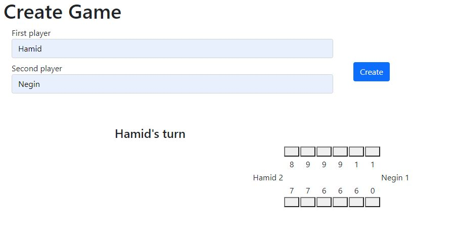

# Getting started
This project is a game called Mancala. You can read about it in the About section as well.

I have tried to keep the structure as simple as possible. In ```mancala-api``` module, there's an OpenApi Specification which introduces the api of project. By using ```swagger-codegen-maven-plugin```, API and models will be generated which I have used and implemented them in ```mancala-service``` module.

As all spring boot projects, we have Controller, Service and Repository packages which contain the main classes. ```GamePlay``` class contains all rules of the game. All custom exceptions and utility classes are in their own packages respectively.

All states of the game after each change will be saved in MySQL database. Properties such as players' name, status of the game, whose turn is it, and state of pits as a string. This will be converted to an array of integers, containing number of stones in each index using ```PitsConverter``` and vice versa. 

Since I like the game so much, I also created a simple front-end application using Angular.



## Used features
* Spring boot/MySQL
* Junit/AssertJ/H2
* API-first approach
* Java code formatter
* Custom exception handler

### Future works
* CI/CD
* Dockerizing the application
* More tests
* Load balancer

## Running the application locally
At the moment the application is not dockerized and since it uses MySQL database, I assume you have that in you local machine.
### Install dependencies
To install all dependencies, you can run the following command:
```
mvn clean install
```
This will clean the project, install dependencies and run all the unit tests.
## Run
You can simply run the Spring boot application by executing the com.bol.mancala.MancalaApplication. Alternatively, you can use maven plugin like so:
```
mvn spring-boot:run
```

## Swagger
After running the application, you can check the OpenApi specification in the following url:
```
http://localhost:8080/api/swagger-ui/index.html#
```

## Formatter
This project is using formatter. To format the code, you can run the following: 
```
mvn com.coveo:fmt-maven-plugin:format
```

# About Mancala Game
## Board Setup
Each of the two players has six pits in front of them. To the right of the six pits,  each player has a larger pit. At the start of the game, there are six stones in each  of the six round pits.
## Rules
### Game Play
The player who begins with the first move picks up all the stones in any of his  own six pits, and sows the stones on to the right, one in each of the following  pits, including his own big pit. No stones are put in the opponents' big pit. If the  player's last stone lands in his own big pit, he gets another turn. This can be  repeated several times before it's the other player's turn.
### Capturing Stones
During the game the pits are emptied on both sides. Always when the last stone  lands in an own empty pit, the player captures his own stone and all stones in the  opposite pit (the other player’s pit) and puts them in his own (big or little?) pit.
### The Game Ends
The game is over as soon as one of the sides runs out of stones. The player who  still has stones in his pits keeps them and puts them in his big pit. The winner of  the game is the player who has the most stones in his big pit.
